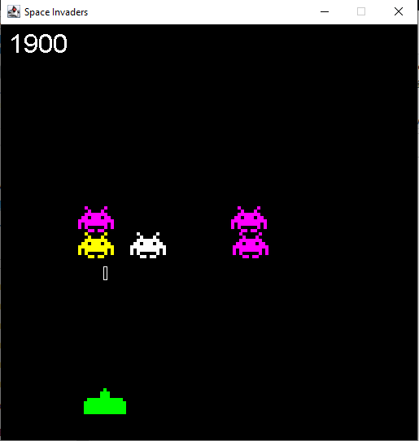

# Space-Invaders

Projeto de um jogo inspirado no clássico **Space Invaders**, desenvolvido em **Java** utilizando **Java Swing**.
O projeto foi desenvolvido com o objetivo de praticar conceitos de **Programação Orientada a Objetos**, criação de interfaces gráficas, eventos de teclado, colisões, listas, temporizadores e lógica de jogos.

## Sobre o projeto

O jogador controla uma nave espacial localizada na parte inferior da tela e deve destruir os alienígenas antes que eles alcancem sua posição.
Os alienígenas se movimentam horizontalmente pela tela e, ao atingirem as bordas, avançam uma linha. A cada fase concluída, a quantidade de alienígenas aumenta, tornando o jogo progressivamente mais desafiador.

O jogo possui:

* 🚀 Nave controlável pelo jogador
* 👾 Diferentes sprites de alienígenas
* 🔫 Sistema de disparos
* 💥 Detecção de colisões
* 🏆 Sistema de pontuação
* 📈 Aumento progressivo da dificuldade
* 🔄 Reinício após Game Over
* ⏱️ Loop de jogo utilizando `javax.swing.Timer`
* 🎨 Interface gráfica utilizando Java Swing

## 🕹️ Controles

| Tecla                         | Ação                         |
| ----------------------------- | ---------------------------- |
| `←`                           | Mover a nave para a esquerda |
| `→`                           | Mover a nave para a direita  |
| `SPACE`                       | Disparar                     |
| Qualquer tecla após Game Over | Reiniciar o jogo             |

## Screenshot



## Estrutura do projeto

```text
SpaceInvaders/
├── src/
│   ├── App.java
│   ├── SpaceInvaders.java
│   ├── ship.png
│   ├── alien.png
│   ├── alien-cyan.png
│   ├── alien-magenta.png
│   └── alien-yellow.png
└── README.md
```

## Tecnologias utilizadas

* **Java**
* **Java Swing**
* **AWT**
* **ArrayList**
* **Event Handling**
* **Collision Detection**
* **Game Loop**

## Conceitos praticados

Durante o desenvolvimento foram utilizados diversos conceitos importantes de programação:

* Programação Orientada a Objetos
* Classes e objetos
* Classes internas
* Encapsulamento
* Herança
* Interfaces
* `ArrayList`
* Eventos de teclado com `KeyListener`
* Eventos com `ActionListener`
* `Timer`
* Manipulação de imagens
* Detecção de colisões
* Estruturas de repetição
* Condicionais
* Gerenciamento de estado do jogo

## Como executar

### Pré-requisitos

É necessário ter o **Java JDK** instalado no computador.

### Executando o projeto

1. Clone o repositório:

```bash
git clone https://github.com/SEU-USUARIO/SpaceInvaders.git
```

2. Abra o projeto em uma IDE compatível com Java, como:

* Eclipse
* IntelliJ IDEA
* Visual Studio Code

3. Certifique-se de que os arquivos de imagem estejam no local correto.

4. Execute a classe:

```text
App.java
```

## 📚 Objetivo

Este projeto faz parte dos meus estudos de **Ciência da Computação** e desenvolvimento em Java.
A ideia foi utilizar um projeto prático para aplicar conceitos de programação e, ao mesmo tempo, desenvolver uma aplicação visual e interativa.

## Autor

**Marco Antônio de Oliveira**

Estudante de **Ciência da Computação**, com foco em desenvolvimento de software e experiência prática em projetos utilizando Java, Python e C++.


